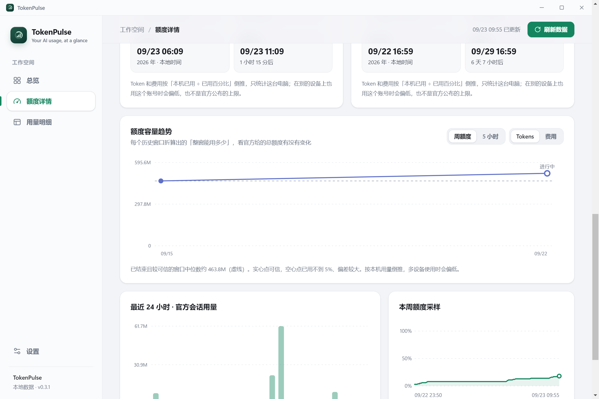
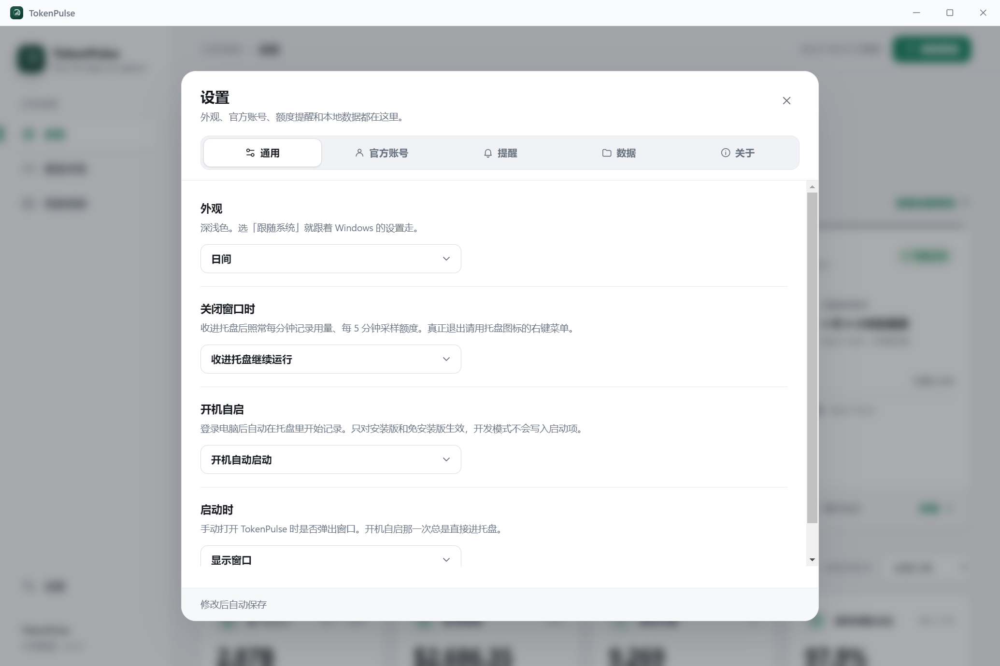

<div align="center">


# TokenPulse

**Your AI usage, at a glance.**

一个常驻托盘的桌面小工具：记下本机所有 AI CLI 的 token 消耗，<br>
盯住各家官方订阅的 5 小时 / 周额度，按最近趋势估计达到上限的时间，并显示重置时预计使用比例。

[](https://github.com/JohnMuyuan/TokenPulse/releases/latest)
[](https://github.com/JohnMuyuan/TokenPulse/releases)


[**下载安装**](https://github.com/JohnMuyuan/TokenPulse/releases/latest) · [功能](#-功能) · [工作原理](#-工作原理) · [隐私](#-数据与隐私) · [开发](#-开发)


</div>

---

## ✨ 功能

<table>
<tr>
<td width="50%" valign="top">

### 📊 本机用量，一笔不漏
增量读取各家 CLI 自己写下的会话记录。终端里跑的、IDE 插件跑的、别的壳子跑的，都算在内。**不改 Base URL，不挂代理，也不拦截网络请求。**

</td>
<td width="50%" valign="top">

### ⏱️ 官方额度，掌握节奏
复用 CLI 已保存的登录凭据查询官方 5 小时 / 周额度，不用再登录一次。显示双窗口剩余、重置倒计时、按最近趋势估计的达到上限时间和重置时预计使用比例。

</td>
</tr>
<tr>
<td valign="top">

### 🔍 明细可查，随时导出
逐条看每一次请求：用了多少 Token、约占多少 5 小时 / 周额度、谁发的、型号对不对；也能切到按日期 + 工具 + 模型聚合。时间选择器支持今天 / 一天（过去 24 小时）/ 7 / 14 / 30 / 90 天 / 全部，也可以在月历上点选任意起止日期；数据永久保存，范围不设上限。数字默认精确到个位，中文界面再附一个「≈30.3亿」方便读。可搜索、排序、分页。CSV 导出当前筛选下的**全部**匹配记录，不受分页限制。

</td>
<td valign="top">

### 🪶 安静地待在托盘
关掉窗口也不退出，开机自启，悬停托盘图标就能看到当前额度。外观支持日间 / 夜间 / 跟随系统，扫描放在后台线程，不卡界面。

</td>
</tr>
<tr>
<td colspan="2" valign="top">

### 🧾 每一次请求，都能核对型号
「用量明细」逐条列出本机的每一次 API 请求：时间、项目、**发出的账号**、型号、token、费用、响应 ID；额度详情里每个账号下面也能看到它自己的请求。并核对**你要的型号**和**上游返回的型号**是不是同一个 ——
对不上标「型号不一致」，型号名对得上但响应格式不像官方（比如号称 Claude、响应 ID 却是 OpenAI 格式）标「响应存疑」，发现就发系统通知。只读本机记录，不额外发请求、不花额度。

</td>
</tr>
<tr>
<td valign="top">

### 💬 会话管理，接着聊
自动读取 Claude Code、Codex CLI 和 Grok Build 的本机会话历史，左边列表、右边对话，按 Agent、项目、关键词筛选。一键复制项目地址；直接在 TokenPulse 里回复，回答实时流出来，只读或允许改文件两档可选。

</td>
<td valign="top">

### 🧩 干净的对话，不是日志
CLI 注入的环境信息、系统提示、子代理记录都滤掉，工具调用折叠成一行；标题用 CLI 自己起的。索引缓存后打开只要几十毫秒。

</td>
</tr>
<tr>
<td valign="top">

### 🔄 CC Switch 历史，一并补上
只读 [CC Switch](https://github.com/farion1231/cc-switch) 的本地库，补上 CLI 早已清掉的老会话和 OpenCode 这类 TokenPulse 不扫描的工具。同一天同一个工具两边都有时只算一份，不会重复。走它本地代理的请求，还会用代理看到的上游型号来核验。

</td>
<td valign="top">

### 📚 模型知识库 · 🌐 English
单价和型号等价规则放在 `knowledge/models.json`，新型号出来后在「设置 → 关于」里更新一下就能认出来、算出费用，不用等新版本。界面支持简体中文和 English，托盘菜单和通知一起切换。

</td>
</tr>
</table>

### 支持的工具

| CLI | 本机用量 | 官方账号 | 额度信息 |
|-----|:---:|------|------|
| **Claude Code** | ✅ | Claude | 5 小时 + 周已用百分比、重置时间 |
| **Codex CLI** | ✅ | ChatGPT | 5 小时 + 周已用百分比、订阅档位、手动重置次数 |
| **Grok Build** | ✅ | Grok | 周额度百分比、计费周期、剩余重置次数 |

> [!NOTE]
> Gemini CLI / Qwen / iFlow / Copilot 目前**不在本地写每次请求的 usage**，所以没有数据可统计。
> 等它们写了，在 `src/core/usage-scan.ts` 的 `roots()` 和解析函数里加一档就能支持。

## 📸 截图

<table>
<tr>
<td><p align="center"><sub>额度详情：达到上限预测、Token 与费用折算</sub></p></td>
<td><p align="center"><sub>额度容量趋势：历史窗口的总额度走势</sub></p></td>
</tr>
<tr>
<td><p align="center"><sub>用量明细：逐条请求、账号、额度占用与型号核验</sub></p></td>
<td><p align="center"><sub>设置：外观、官方账号、提醒、数据与自动更新</sub></p></td>
</tr>
<tr>
<td><p align="center"><sub>深色主题</sub></p></td>
<td><p align="center"><sub>窄窗口布局</sub></p></td>
</tr>
</table>

## 📦 安装

到 [**Releases**](https://github.com/JohnMuyuan/TokenPulse/releases/latest) 下载最新版本：

> **当前版本：v0.3.4** — 额度页点账号只是切换；按住账号左右拖可以调整同一家账号的显示顺序。账号较多时，在这一行下面拖动滚动条查看其余账号。

| 文件 | 说明 |
|------|------|
| `TokenPulse-x.y.z-Setup.exe` | **安装版（推荐）**。可选安装路径，自动创建开始菜单快捷方式 |
| `TokenPulse-x.y.z-Portable.exe` | 免安装单文件，双击即用 |

启动后 TokenPulse 会常驻系统托盘。关闭窗口只会收回托盘，**退出请用托盘右键菜单**。

**自动更新**：安装版会在后台检查并下载新版本，等窗口收进托盘或最小化时静默安装、自动重启，不需要手动操作；可在「设置 → 关于」里改成「只提醒」或手动检查。便携版不支持自动更新，请到 Releases 下载新版本。

> [!TIP]
> 安装包没有代码签名，Windows SmartScreen 第一次运行时可能拦截，点「更多信息 → 仍要运行」即可。

**前提**：本机至少用过一个支持的 CLI。要看官方额度，还需要在对应 CLI 里登录过官方账号。哪家凭据过期或没登录，那家就不显示，不影响其他几家。

## 🧠 工作原理

<details open>
<summary><b>用量从哪来</b></summary>

<br>

每家 CLI 在每次 API 请求后都会往自己的会话文件里写一条 usage。这是本机唯一一份「全都算上」的账。TokenPulse 按字节偏移增量读取这些文件，几百兆的会话文件也不会每次重读。

| CLI | 会话文件 |
|-----|----------|
| Claude Code | `~/.claude/projects/<项目>/<会话>.jsonl` |
| Codex CLI | `~/.codex/sessions/<日期>/rollout-*.jsonl` |
| Grok Build | `~/.grok/sessions/**/updates.jsonl` |

去重、缓存 token 口径和「官方账号 / 中转站」归属判断都做了专门处理，细节见 [HANDOFF.md](HANDOFF.md) §4。

</details>

<details open>
<summary><b>预测怎么算</b></summary>

<br>

官方接口只给出**当前时刻**的已用百分比，既没有历史，也不说额度到底是多少 token。所以 TokenPulse 每 5 分钟采一次样，自己积累历史：

- **达到上限的时间以最近趋势为主**：在最近 24 小时（5 小时窗口取最近 1 小时）里，用多个采样跨度计算加权中位数，降低单次跳点的影响；近期跨度不足时才退回整窗平均。近期没有新增用量时不输出虚假的耗尽时间。
- **最近 24 小时的速度**只用来提示「最快可能什么时候用完」，不当作结论。
- **整窗容量折算**：比如这周用了 9800 万 token、官方显示已用 24%，折算下来整周大约 4 亿 token。已用不到 2% 时不给出这个数，已用越多越准，界面上会标出可信度。
- **Token 与费用预测**：用整窗容量把百分比换成 Token 和费用——剩余还能用多少、按当前趋势到重置时会用多少。额度详情里还有「额度容量趋势」折线，看每个历史窗口折算出的总额度有没有变化；用得太少（< 2%）或本机没有用量的窗口不计入，已用不到 5% 的标为偏差较大。
- **跨越重置**：到点重置或手动重置之前的样本不计入。如果已经过了重置时间、接口还没再查过，就按新窗口从 0 开始算，不会沿用上个窗口的数字。

总览卡片上的圆环显示**剩余最少的那个窗口**，避免周额度充足时掩盖了 5 小时窗口快要用完；卡片底部直接给出「重置时预计已用多少」或「约多久后用完」。

</details>

<details>
<summary><b>关于费用</b></summary>

<br>

**费用是估算，不是账单。** Grok 在会话文件里自报了花费，直接采用。Claude Code 和 Codex 的会话文件里只有 token，只能按公开单价估算（见 `src/core/model-pricing.ts`）。未识别定价的模型显示为「未定价」，不会被当作免费。

额度监控只统计**走官方登录账号**的会话。用 API Key 或中转站跑的请求不占订阅额度，会被排除，界面上会写明排除了多少个会话。

</details>

## 🔒 数据与隐私

所有数据都只保存在本机的 `~/.tokenpulse/`，**不会上传到任何地方**。唯一的网络请求是向各家官方接口查询额度。

| 文件 | 内容 | 删除后 |
|------|------|--------|
| `usage-rollups.json` | 每个会话文件的扫描进度和统计结果 | 从头重扫一遍，几秒钟，不丢数据 |
| `quota-history.json` | 官方额度采样历史（永久保留） | 速度和预测要重新积累，**官方不提供历史，删了就找不回来** |
| `cc-switch.json` | 从 CC Switch 库里读出来的副本（只读它的库，不改） | 下次扫描重新读 |
| `cli-logins.json` | 各 CLI 登录过哪些账号、从什么时候开始（只有账号 id 和邮箱，不含凭据），用来把请求对到账号上 | 以后的请求照常对；之前的按最早的账号推断 |
| `knowledge.json` | 从 GitHub 下载的新版模型知识库（单价、型号等价规则） | 回到安装包内置的那份 |
| `requests/<年-月>.jsonl` | 每一次请求的元数据（时间、型号、token、响应 ID、工作目录，不含正文） | 会话文件还在的部分下次扫描补回；CLI 已经清掉的会话就找不回来了 |
| `official-accounts.json` | 登记过的官方账号、活动选择，以及在 TokenPulse 里添加的账号的凭据（含 refresh token） | 回到使用各 CLI 当前登录的账号；在 TokenPulse 里添加的账号需要重新添加 |
| `prefs.json` | 开机自启、关窗收进托盘、提醒阈值 | 恢复默认设置 |

明细只按「日期 + 工具 + 模型」聚合，不读取、展示或导出会话正文。官方 CLI 自己的登录只读取、不复制；在设置里额外添加的 OAuth 账号，凭据（access token 和续期用的 refresh token）保存在本机 `~/.tokenpulse/official-accounts.json`，仅用于额度查询、不会上传，并在过期前自动续期；这个文件应按密码文件保护。CLI 自己的登录不会被 TokenPulse 续期，免得把 CLI 登出。唯一的系统级副作用是开机启动项（`HKCU\...\Run\com.tokenpulse.app`），可以在设置里关闭。

## 🛠 开发

```bash
npm install
npm run icons         # 生成 packaging/icon.png 和 tray.png
npm run dist:portable # 只编译免安装版，供本机测试
npm start             # 编译并启动
npm test              # 额度、扫描、看板、官方账号、请求流水与型号核验、知识库 / CC Switch / 英文词典
npm run test:ui       # Electron 界面测试：预测、筛选、主题、导出、布局与失败恢复
npm run test:update   # 自动更新：本地假更新服务器上走完检查 → 下载 → 校验 → 静默安装触发
npm run dist          # 重新生成图标并打包安装版与免安装版到 dist/（不会自动发布）
```

打开「设置 → 官方账号」即可添加多个官方账号。点击「添加账号」后，TokenPulse 调用对应的官方 CLI，在你的**默认浏览器**里打开官方授权页（浏览器里已登录的账号可以直接确认）；登录写进一个隔离的临时目录，不会动 CLI 自己的登录。**所有账号的额度都会查询**，首页和额度详情里一个账号一张卡片；在设置里可以拖动调整顺序、给账号起名字、删除不要的账号（CLI 还登录着的账号只能隐藏，随时可以恢复）。

TypeScript 编译到 `build/`，安装包输出到 `dist/`。开发模式下**不会写入开机启动项**，只有打包版才会真正设置自启。

<details>
<summary><b>项目结构</b></summary>

```
src/core/            纯逻辑，不依赖 Electron，可以单独 require 测试
  usage-scan.ts      增量扫描会话文件 → 按天 / 按小时的账
  quota.ts           查询三家官方额度接口
  quota-history.ts   额度采样历史
  quota-monitor.ts   速度、预测、健康度（纯函数）
  model-pricing.ts   模型单价表
  report.ts          汇总成界面使用的快照
  request-log.ts     每一次请求的流水（按月追加、去重、查询）
  request-verify.ts  型号核验规则（纯函数）
  cc-switch.ts       只读导入 CC Switch 的用量（node:sqlite）
  knowledge.ts       模型知识库：单价和型号等价规则（knowledge/models.json，可在线更新）
  report-worker.ts   在后台线程执行扫描与汇总
src/main/            Electron 主进程：托盘、定时器、IPC、通知
renderer/            界面：原生 JS、无构建步骤，图表为手写内联 SVG
  data.js            日期筛选、聚合、对比与 CSV 编码（浏览器 / Node 共用）
  brand.js           官方品牌图标（Claude / OpenAI / Grok）的 SVG 路径
scripts/             测试、截图与图标生成
```

`scripts/capture-ui.cjs` 用真实本机数据生成截图到 `artifacts/ui/`（`npx electron scripts/capture-ui.cjs`），读写都在隔离的临时目录里进行；只复制一份额度采样历史进去画预测和趋势图，不会改动现有账本，也不带任何账号凭据。

</details>

<details>
<summary><b>打包卡在 winCodeSign？</b></summary>

<br>

Windows 上第一次打包可能报：

```
ERROR: Cannot create symbolic link : 客户端没有所需的特权
  ...\Cache\winCodeSign\<随机数>\darwin\10.12\lib\libcrypto.dylib
```

electron-builder 下载的 winCodeSign 压缩包里带了 macOS 符号链接，Windows 没开「开发者模式」时建不了，整个解压就会失败。项目不做签名，只需要其中的 `rcedit`。手动解压一次、跳过 macOS 部分即可：

```bash
CACHE="$LOCALAPPDATA/electron-builder/Cache/winCodeSign"
# 先跑一次 npm run dist，让它把 .7z 下载下来（解压会失败，没关系）
SRC=$(ls -S "$CACHE"/*.7z | head -1)
node_modules/7zip-bin/win/x64/7za.exe x -bd "$SRC" -o"$CACHE/winCodeSign-2.6.0" '-x!darwin*'
rm -f "$CACHE"/*.7z
```

目录名必须正好是 `winCodeSign-2.6.0`。版本号可以用下面的命令查：

```bash
node_modules/app-builder-bin/win/x64/app-builder.exe download-artifact --name winCodeSign
```

</details>

## 🗺 路线图

- [ ] 扩充 `usage-scan.ts` 单元测试（目前覆盖 Codex 型号识别）
- [ ] 在真实账号上验证 Grok 额度链路
- [ ] 托盘菜单增加「暂停记录」
- [ ] 按项目 / 目录维度统计用量
- [ ] 额度重置时提醒「新窗口开始」
- [ ] 自动更新
- [ ] macOS / Linux 支持

<div align="center">
<br>
<sub>Made with ☕ for people who live in the terminal.</sub>
</div>
