<div align="center">


# TokenPulse

**Your AI usage, at a glance.**

一个常驻托盘的桌面小工具：记下本机所有 AI CLI 的 token 消耗，<br>
盯住各家官方订阅的 5 小时 / 周额度，按最近趋势估计达到上限的时间，并显示重置时预计使用比例。

[](https://github.com/JohnMuyuan/TokenPulse/releases/latest)
[](https://github.com/JohnMuyuan/TokenPulse/releases)


[**下载安装**](https://github.com/JohnMuyuan/TokenPulse/releases/latest) · [功能](#-功能) · [工作原理](#-工作原理) · [隐私](#-数据与隐私) · [开发](#-开发)

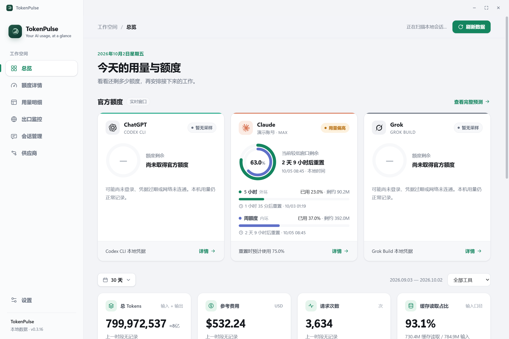

</div>

---

> 每个版本改了什么见 [Releases](https://github.com/JohnMuyuan/TokenPulse/releases)；软件里升级后也会弹一次「新版本有什么」。

## 🔀 供应商切换与本地路由

侧边栏的「供应商」页面左边是二级菜单：**概览**（四个工具现在用谁、直连还是本地路由）、**Claude Code / Claude 桌面端 / Codex / Grok CLI**（各自的供应商列表）、**路由服务**、**转发记录**、**导入供应商**、**配置保护**。每个工具可以保存多家供应商，点「启用」就切换；新增和编辑按左侧的步骤菜单一步步填，列表可以拖动排序。切换只改请求地址、密钥和模型，插件、Hook、MCP 和注释留在原处。

接口和工具不一致时会打开本地路由：工具只访问 `127.0.0.1`，TokenPulse 在后台把请求转到当前供应商，并在 Anthropic、OpenAI Chat、OpenAI Responses 之间转换文本和函数调用。备用供应商在当前一家返回 429 或 5xx 时接上。托盘菜单可以按工具切换。退出 TokenPulse 时配置写回直连，下次启动再接回路由。

官方登录仍由各工具自己保存，TokenPulse 不读取这些凭证。已有的 CC Switch 供应商可以导入。

**代理**：软件里往外发的请求（本地路由转发、查额度、出口检测、自动更新等）用同一条规则——环境变量里有代理（`HTTPS_PROXY` 等）就用它，没有就用系统代理，都没有才直连；本机地址永远直连。本地路由转发只支持 HTTP 代理（SOCKS 代理按直连）。TokenPulse 启动的 CLI 不额外加代理，和你自己在终端里运行时走同一条路。

- **头像**：编辑供应商的第一步可以选头像：按名称和地址自动匹配，或者从 25 个预设厂商图标里选（图标来自 AllAi），也可以上传图片（自动缩到 128px）。
- **号池**：Claude Code、Codex、Grok CLI 可以把「设置 → 账号」里登录的多个官方账号，和已保存的 API Key 供应商组成号池。本地路由按「轮询」或「用满再换」在成员间转发；某个成员返回 401、403、429、5xx 或连不上时换下一个，连续失败的暂停 60 秒。官方账号成员只换认证信息，请求仍是 CLI 自己发出的原样内容。号池只能经本地路由使用，账号凭据不会写进任何工具配置。用号池轮换多个订阅账号是否符合各家服务条款，请自行判断。
- **配置预览**：每家供应商的行上和当前供应商卡片上都有「配置预览」，直接打开编辑页的预览步骤，查看切换后工具会看到的配置（密钥已脱敏）。
- **Codex 1M 上下文**：编辑 Codex 供应商时可以一键放开到 1M（写入 `model_context_window = 1000000`、`model_auto_compact_token_limit = 900000`），也可以自己填。

### 配置保护：不怕改坏工具配置

- **改动前先确认**：要改 Claude / Codex / Grok 的配置文件时，先列出每个文件的逐行对比（密钥打码），点「确认写入」才写；确认之后文件又被别的程序改了，就不写。写入时保留你原来的缩进、注释和其他设置。
- **每次改动都有备份**：最近 50 次改动都能在「供应商 → 配置保护」里一键还原，还原本身也能撤回；TokenPulse 第一次改某个文件之前的原件永久保留，随时可以恢复。
- **只读保护**：打开后 TokenPulse 完全不改工具配置，切换供应商、启用路由都会被拦下；关闭路由、还原备份仍然可以做。

### 配置被改走时提醒

TokenPulse 切换过的 Claude Code、Claude 桌面端、Codex、Grok CLI，如果配置又被改走了（别的工具改了地址，或者 Grok 继续旧会话时换回那个会话记住的模型），TokenPulse 会在右上角说明是哪个工具、现在连的是谁、可能的原因，并给出「切回」按钮（同样先看对比再确认）；窗口在托盘里时发系统通知。同一次改动只提醒一次。CLI 自己改其他设置（权限、主题、在同一家里用 /model 换模型）不算。

Grok 的 `/model` 列表里，TokenPulse 的路由显示为「TokenPulse · 供应商名」。**用 Grok 号池时请新开会话，或者在旧会话里输入 `/model tokenpulse_route`**，否则继续旧会话会换回旧模型。

### 写给 Codex 的配置，先让 Codex 试读

切到第三方或开启本地路由之前，TokenPulse 会让本机的 Codex 在临时目录里试读一遍要写的模型目录（只加载配置、不联网、不碰真实的 `~/.codex`）。Codex 更新后格式变了、读不了时，就不写这份目录并提示——Codex 照样能进，只是模型列表用它自带的。启动时还会自动修复旧版本留下的坏配置（有备份，只读保护开着就只提示）。

### Prism 桥：账号被降智时，换一条路用回完整的模型

**适合谁用**：ChatGPT 账号被「降智」了——官方登录下模型明显变笨，或者被悄悄换成了低一档的型号。走 Prism 桥，Codex 经你自己的 Prism 账号发请求，拿到的是没有被降级的模型。**账号正常就没必要用**：官方登录的回复是边生成边显示的，没有限流等待，也不用担多余的风险。

供应商 → 本地路由 → **Prism 桥**。页面顶部会写明现在到哪一步、下一步点什么。一共四步：

1. **安装运行环境**：Python 环境、playwright 和 Chromium，装在 TokenPulse 的数据目录里（`~/.tokenpulse/prism-bridge`），不影响电脑上别的 Python。电脑上没有 Python 时先用 winget 安装；官方下载源太慢时自动换国内镜像。
2. **登录**：用你电脑上的 Chrome 或 Edge 打开一个单独的登录窗口（正常启动的浏览器，不带你平时的登录状态），登录你自己的 OpenAI 账号，看到 Prism 的界面后把窗口关掉。登录状态约十天过期。
3. **启动服务**：在 `127.0.0.1` 上开一个 OpenAI 兼容接口（Responses / Chat Completions），只有本机能访问，并带一个随机密钥。可以设成跟着 TokenPulse 启动；退出 TokenPulse 时服务一起停。
4. **接到 Codex**：地址和密钥自动填好，加成 Codex 的一家供应商并启用。想换回官方登录，到 Codex 页面启用官方那一家。

> ⚠️ 这不是官方提供的用法：它用浏览器自动操作你自己的 Prism 账号，**可能不符合 OpenAI 的服务条款，账号有被限制的风险**，请自己决定要不要用。只给本人在自己电脑上用，不要转售或共享。
>
> 已知限制：回复是整段生成完才返回的；短时间连发多轮会被 Prism 限流几十秒到十几分钟（每次工具调用都算一轮）；Prism 网页改版后可能失效。

**常见问题**

- **用的是哪里的额度？会扣 Codex 的额度吗？** 不扣 Codex 的额度。请求发到的是 Prism 这个网页产品，和 Codex 的 5 小时、每周额度不是一回事。Prism 自己有没有总量上限，没有公开的数字。已知的是频率限制：短时间连发多轮会被拒绝几十秒到十几分钟。
- **为什么 TokenPulse 里看不到这部分用量？** Prism 桥不返回 Token 用量，所以经它发的请求不会出现在用量统计和额度里。
- **最大上下文是多少？** 模型在 Prism 那边的上下文窗口没有公开的数字。桥这一层的限制是：单轮输入约 8.6 万字节，超出会自动拆成最多 8 轮发进同一个会话（合计约 68 万字节），再超出时 Codex 会自己压缩历史后重试。TokenPulse 写给 Codex 的上下文窗口是 128000，这是默认值，不是实测的，可以在 Codex 页面编辑这家供应商时改。
- **思考强度有哪些？** 实际只有 low、medium、high 三档，默认 high。在 Codex 里选更高的（xhigh、max、ultra）按 high 算，选 minimal 按 low 算。

**出了问题怎么查**

- **Codex 报 `502 Bad Gateway`，Prism 桥的日志里却什么都没有**：多半是系统里设了代理（`HTTP_PROXY` / `ALL_PROXY`），又没有把本机地址排除在外，Codex 发往 `127.0.0.1` 的请求被代理截走了。服务启动后 TokenPulse 会经那个代理实际试一次，有这个问题就在页面顶部提醒，点「一键修复」会把 `127.0.0.1,localhost,::1` 加进用户环境变量 `NO_PROXY`（原来的条目保留），然后把 Codex 和终端完全关掉再打开。
- **日志**：除了显示在页面上，也写进 `~/.tokenpulse/prism-bridge/bridge.log`（超过 1 MB 会把旧的挪成 `bridge.log.1`），点「打开日志文件」就能找到，方便发给别人帮忙看。

**不想用了，一键删除**

Prism 桥页面最下面的「全部删除」（要点两次确认）：停掉服务，删掉运行环境、这次安装下载的 Chromium、登录信息、设置和日志，并去掉 Codex 里的「Prism 桥」供应商（Codex 正在用的话先切回官方登录）。页面上会写现在占了多少空间。不会动 TokenPulse 本身、电脑上的 Python、别的程序装的浏览器，以及「一键修复」设过的 `NO_PROXY`。

程序来自开源项目 Prism Bridge（作者 [@yyyllllming](https://github.com/yyyllllming)，MIT 协议），源码在 `vendor/prism-bridge`。

## 🧭 本机以外的使用

官方额度是整个账号的：网页 / App 聊天、别的电脑也在用。TokenPulse 按额度采样的时间段来区分：

- 额度涨了、同期本机没有任何 Code 请求：识别为「本机以外」的使用，不计入容量折算，并标在「模型与思考等级 · 时间线」的「本机以外」轨道上；
- 额度涨了、同期本机有 Code 请求：按本机用量折算整窗容量（同一时刻也在聊天的话分不出来，会让容量略微偏小）；
- 点时间线上的「本机以外」色块，可以像剪视频一样分割、删除（不算本机以外）、恢复，或者标注这段时间在哪里、用了什么模型、什么思考等级；也可以按住右键拖选一段来标注。标注过的时段不进折算，并按这个模型 × 等级的整窗容量换算成大约多少 Token。

时间线可以放大：按住右键拖选一段再点「放大到这段」，Ctrl + 滚轮以鼠标位置缩放，或者用右上角的按钮；放大后左键拖动平移。周期标题旁的圆圈问号里有每种颜色、竖条的说明。额度容量趋势、整窗容量折算、「换一种模型，整窗能用多少」都按这个口径计算。

如果某个账号只在这台电脑上用 Code、不在网页或 App 里聊天，也可以在「设置 → 账号」里打开「只在本机用 Code」：这个账号按「本机用量 ÷ 已用百分比」直接折算。

## 🧠 模型 × 思考等级

- **额度详情 → 换一种模型，整窗能用多少**：5 小时和周两个窗口一起列出全部可用的模型和思考等级，每个组合换算成「整窗约多少 Tokens、约多少次调用、本周期还剩多少」，用条形图排行；可按容量、请求次数、常用程度、名称排序，按等级筛选。
- 换算口径：先用本账号最近 30 天的额度采样算出「整窗预算」（API 等价费用 ÷ 官方已用百分点 × 100，混用模型的区间也能用），再按每个组合的每 Token 参考单价换算。实测表明官方额度大体按 API 等价费用消耗；有足够纯区间的组合直接用实测值，标「实测」。
- **模型与思考等级时间线**（在额度详情里，跟随账号标签）：当前 5 小时周期和本周周期两条时间线，每个组合一条轨道，连续使用连成一段，上方叠加官方额度已用曲线；可翻看以前的周期，点一个组合只看它。
- 经 CC Switch 等把 CLI 指到别家模型的请求不计入这一家的额度。旧日志没记录的思考等级保持未知，不从当前配置回填；首次运行会为仍保留的日志补采等级。
- **点一行看详情**：两个整窗各能用多少、四项标价（输入 / 缓存读 / 缓存写 / 输出）和来源、综合单价是怎么按你的 Token 结构算出来的、思考等级倍数的出处。每格下面写着调用次数、本周期还剩多少，以及「其中新内容约多少」（Tokens 里绝大部分是每次调用重读整段对话的缓存）。
- **单价标签**：官方优惠价标「优惠价」；两个价格表对不上标「标价不同」（按 LiteLLM 算）；官方调价标「刚降价 / 刚涨价」并在详情里逐项写涨跌幅；只是从按型号家族估算换成这个型号自己的标价的，标「改用实际标价」。
- **添加模型**：右上角「添加模型」可以把没用过的型号加进表格，按单价和思考等级消耗估算。没用够的思考等级优先按你自己的实测推算，其次参考 [Epoch AI](https://epoch.ai/data/ai-benchmarking-dashboard) 的基准数据（CC BY 4.0）。
- 目录来自本机缓存、官方文档和日志，不保证目标账号的模型权限；API 等价费用不是订阅余额。

## 🌐 出口监控

在侧边栏打开「出口监控」，先「立即检测」，为每家填写允许的出口 IP（或点击「加入当前 IP」），保存后开启监控。按设定的间隔（5 到 60 秒，默认 10 秒）检测选定官方域名的出口，支持 IPv4/IPv6 多个允许地址及可选的地区白名单。连续两次异常发出通知，同一异常不重复提醒；支持暂停和查看最近 50 条变化记录。

- 使用供应商域名自己的 trace 信息，不携带账号 token，不调用模型或额度接口；仅代表所选域名经 TokenPulse 当前网络配置的出口，不等同于全部分流规则或其他程序。
- ChatGPT / OpenAI API / Claude 使用分别核实的官方地区清单；规则显示来源与核实日期，超过 90 天按未核实处理。Grok 官方完整清单暂未核实，可设置自定义允许地区。
- 地区未知、检测失败或存在子地区限制均明确提示，不当作正常或确定不支持。IP/地区来自目标站点的出口识别，不能保证具体账号一定可用。
- 每家一张卡片：国旗、出口 IP、城市、ASN、线路类型（家宽 / 机房 / 企业 / 移动），以及 proxycheck.io、ip-api.com、ipinfo.io、ipapi.is 几个公开 IP 数据库给的风险分和 VPN / 代理 / 机房标记。出口 IP 变了才查、结果缓存 12 小时；这会把出口 IP 发给这几家，可以在页面顶部关掉。
- **向官方查额度之前先核对出口 IP**：设了白名单的那家，出口 IP 不在白名单里（或确认不了出口）就不查额度、不续期凭据，并弹警报；首页和额度页会写明「额度查询已暂停」。
- **启动 CLI 之前先核对出口**：出口监控开着时，凡是 TokenPulse 启动的 CLI（新对话、新项目、在终端里继续、在软件里回复）都按那一家的白名单核对，不符合或测不出来就不启动。设了 IP 白名单只看 IP；没设 IP、设了地区白名单看地区；两个都没设或监控关着就直接启动。终端里的检测就在那个终端窗口里做（终端里的 CLI 走的是那个 PowerShell 的网络环境），结果用红 / 绿字写在终端里。
- 监控配置与最近告警仅保存在本机；托盘运行期间继续监控，退出软件即停止。

## ✨ 功能

<table>
<tr>
<td width="50%" valign="top">

### 📊 本机用量，一笔不漏
增量读取各家 CLI 自己写下的会话记录。终端里跑的、IDE 插件跑的、别的壳子跑的，都算在内。**不改 Base URL，不挂代理，也不拦截网络请求。**

</td>
<td width="50%" valign="top">

### ⏱️ 官方额度，掌握节奏
复用 CLI 已保存的登录凭据查询官方 5 小时 / 周额度，不用再登录一次。显示双窗口剩余、重置倒计时、按最近趋势估计的达到上限时间和重置时预计使用比例。 账号可以两种方式添加：直接用本机 CLI 已经登录的那个（TokenPulse 不保存凭据，每次现读 CLI 的登录），或者在 TokenPulse 里登录（保存凭据并自动续期，可以登记多个）。

</td>
</tr>
<tr>
<td valign="top">

### 🔍 明细可查，随时导出
逐条看每一次请求：用了多少 Token、约占多少 5 小时 / 周额度、谁发的、型号对不对；也能切到按日期 + 工具 + 模型聚合。时间选择器支持今天 / 一天（过去 24 小时）/ 7 / 14 / 30 / 90 天 / 全部，也可以在月历上点选任意起止日期；数据永久保存，范围不设上限。数字默认精确到个位，中文界面再附一个「≈30.3亿」方便读。支持统计型号精确多选（候选列表可搜索），并按项目、账号、渠道、型号核验结论和关键词组合筛选；筛选条件在逐条请求与按日汇总间保留。可排序、分页，统计卡片与 CSV 导出跟随筛选；导出包含**全部**匹配记录，不受分页限制。查询失败可保留条件重试。还有完整的用量分析：按工具分色的用量趋势、全部工具和全部型号的排行（不截断，可按 Tokens / 费用 / 请求排序）、一天中各时段和星期 × 时段的使用分布。总览选「今天」时趋势按小时。

</td>
<td valign="top">

### 🪶 安静地待在托盘
关掉窗口也不退出，开机自启，悬停托盘图标就能看到当前额度。外观支持日间 / 夜间 / 跟随系统，扫描放在后台线程，不卡界面。

</td>
</tr>
<tr>
<td colspan="2" valign="top">

### 🧾 每一次请求，都能核对型号
「用量明细」逐条列出本机的每一次 API 请求：时间、项目、**发出的账号**、型号、token、费用、响应 ID；额度详情里每个账号下面也能看到它自己的请求。并核对**你要的型号**和**上游返回的型号**是不是同一个 ——
对不上标「型号不一致」，型号名对得上但响应格式不像官方（比如号称 Claude、响应 ID 却是 OpenAI 格式）标「响应存疑」，发现就发系统通知。只读本机记录，不额外发请求、不花额度。

</td>
</tr>
<tr>
<td valign="top">

### 💬 会话管理，接着聊
自动读取 Claude Code、Codex CLI 和 Grok Build 的本机会话历史，左边列表、右边对话，按 Agent、项目、关键词筛选。一键复制项目地址；直接在 TokenPulse 里回复，回答实时流出来，只读或允许改文件两档可选；不需要的对话可以确认后永久删除。 列表上方的「新对话」「新项目」可以选一个项目文件夹和工具，直接在终端里开始一段新对话。

</td>
<td valign="top">

### 🧩 干净的对话，不是日志
CLI 注入的环境信息、系统提示、子代理记录都滤掉，工具调用折叠成一行；标题用 CLI 自己起的。索引缓存后打开只要几十毫秒。

</td>
</tr>
<tr>
<td valign="top">

### 🔄 CC Switch 历史，一并补上
只读 [CC Switch](https://github.com/farion1231/cc-switch) 的本地库，补上 CLI 早已清掉的老会话和 OpenCode 这类 TokenPulse 不扫描的工具。同一天同一个工具两边都有时只算一份，不会重复。走它本地代理的请求，还会用代理看到的上游型号来核验。

</td>
<td valign="top">

### 📚 模型知识库 · 🌐 English
单价、型号等价规则、思考等级规则和各等级的 token 消耗放在 `knowledge/models.json`，**每天由 GitHub Actions 自动同步**（单价来自 LiteLLM、用 OpenRouter 交叉核对；等级消耗来自 Epoch AI，CC BY 4.0），TokenPulse 每天自动下载，新型号不用等新版本就能认出来、算出费用。手动维护的部分在 `knowledge/manual.json`。界面支持简体中文和 English，托盘菜单和通知一起切换。

</td>
</tr>
</table>

### 支持的工具

| CLI | 本机用量 | 官方账号 | 额度信息 |
|-----|:---:|------|------|
| **Claude Code** | ✅ | Claude | 5 小时 + 周已用百分比、重置时间 |
| **Codex CLI** | ✅ | ChatGPT | 5 小时 + 周已用百分比、订阅档位、手动重置次数 |
| **Grok Build** | ✅ | Grok | 周额度百分比、计费周期、剩余重置次数 |

> [!NOTE]
> Gemini CLI / Qwen / iFlow / Copilot 目前**不在本地写每次请求的 usage**，所以没有数据可统计。
> 等它们写了，在 `src/core/usage-scan.ts` 的 `roots()` 和解析函数里加一档就能支持。

## 📸 截图

> 截图里全部是软件自带的**演示数据**（虚构的「演示账号」，和新手引导用的是同一份）；出口监控是文档专用地址段的示意数据。不含任何真实账号、用量或出口信息。

<table>
<tr>
<td>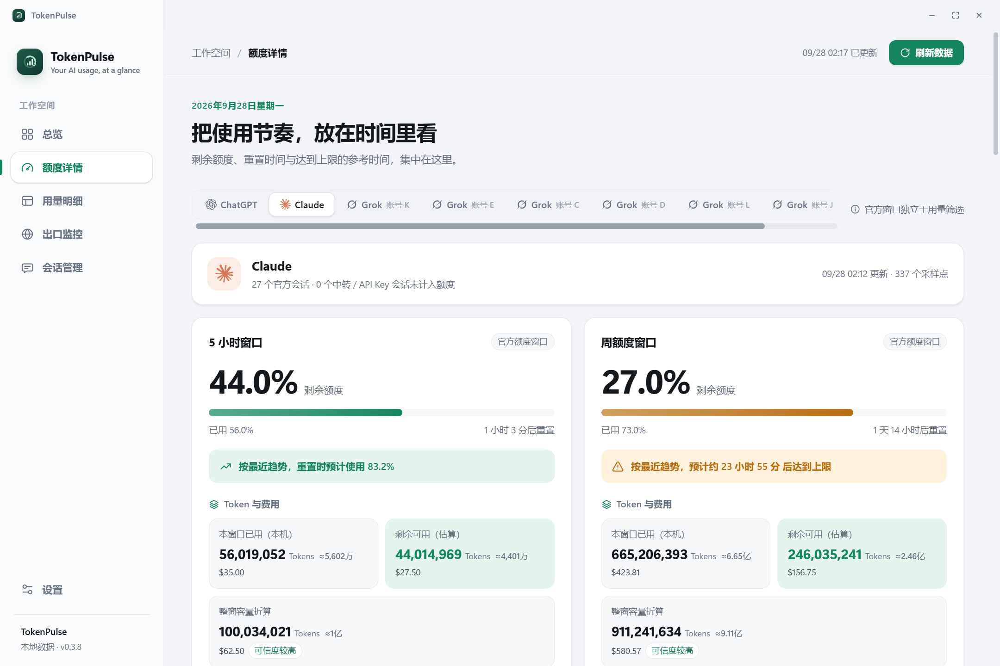<p align="center"><sub>额度详情：达到上限预测、Token 与费用折算</sub></p></td>
<td>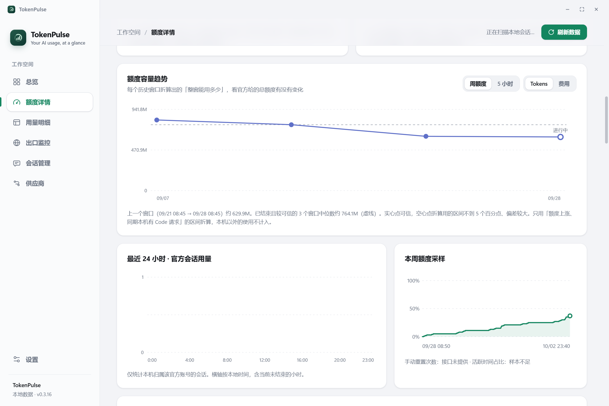<p align="center"><sub>额度容量趋势：历史窗口的总额度走势</sub></p></td>
</tr>
<tr>
<td>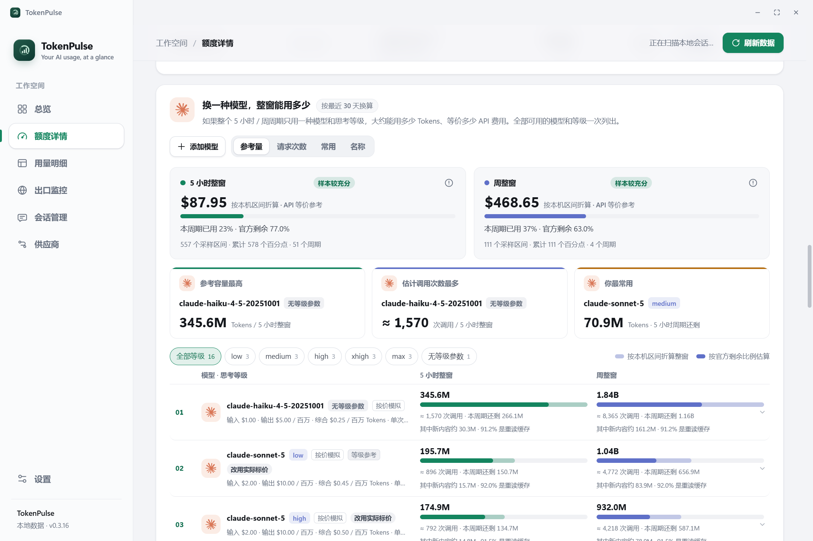<p align="center"><sub>换一种模型，整窗能用多少：全部模型 × 思考等级的容量排行</sub></p></td>
<td>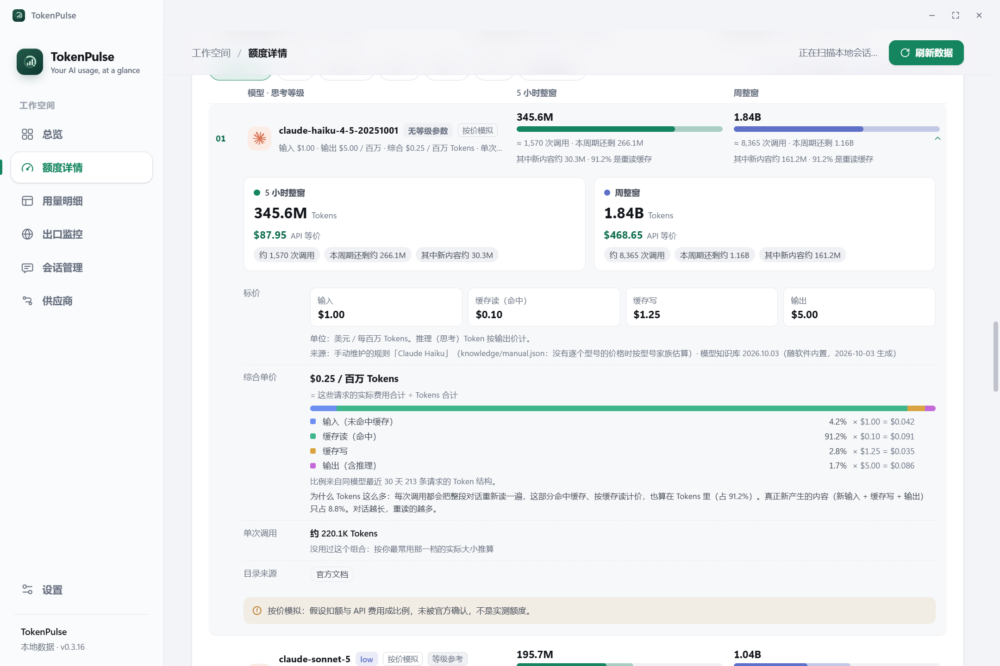<p align="center"><sub>点开一行看详情：四项标价、来源、综合单价怎么算的</sub></p></td>
</tr>
<tr>
<td>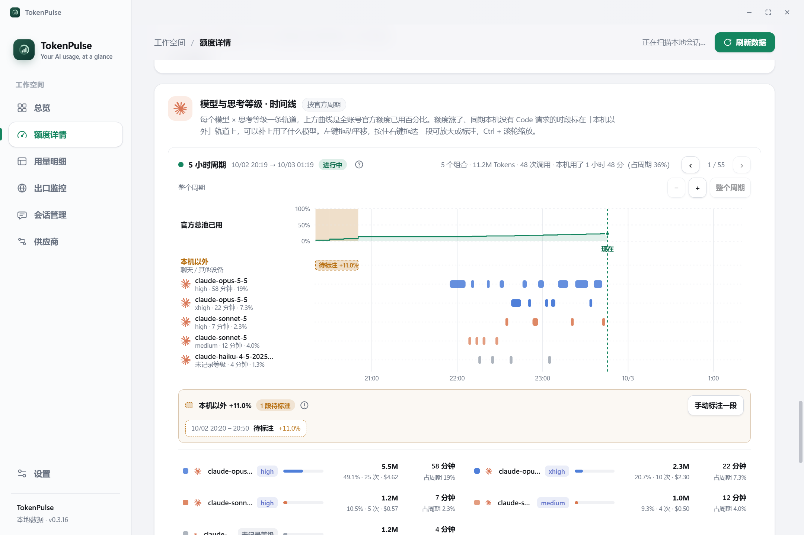<p align="center"><sub>模型与思考等级时间线：每个组合用了多久，「本机以外」可以分割、标注</sub></p></td>
<td>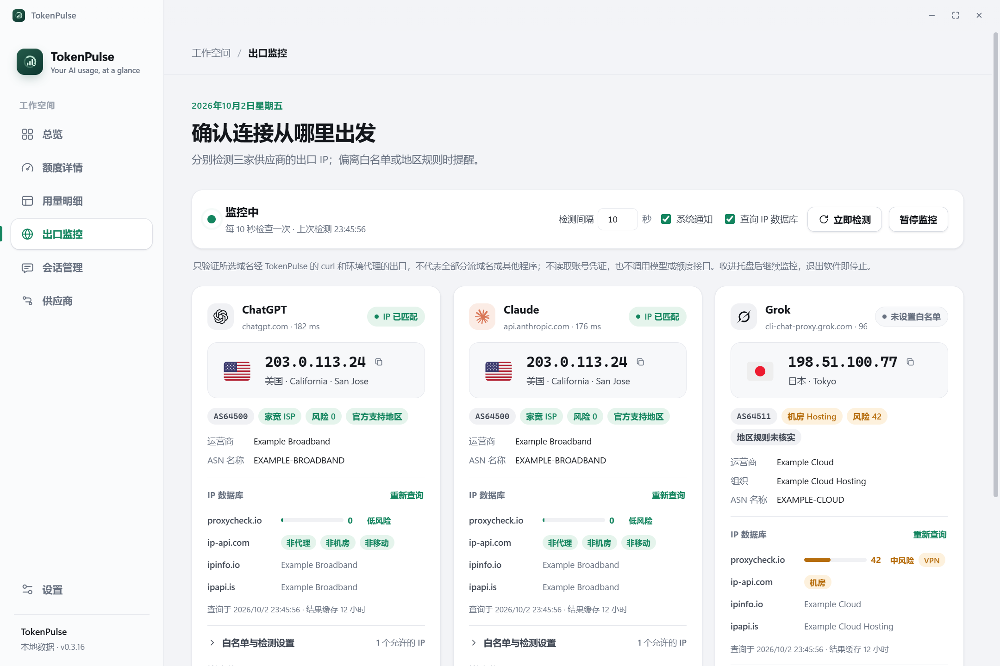<p align="center"><sub>出口监控：检测间隔、国旗、ASN、线路类型与 IP 数据库评分</sub></p></td>
</tr>
<tr>
<td>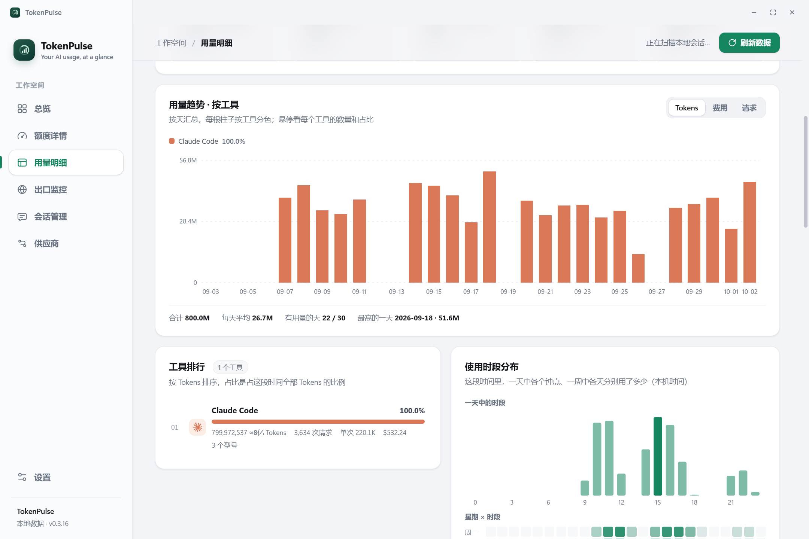<p align="center"><sub>用量明细：按工具分色的用量趋势与工具排行</sub></p></td>
<td>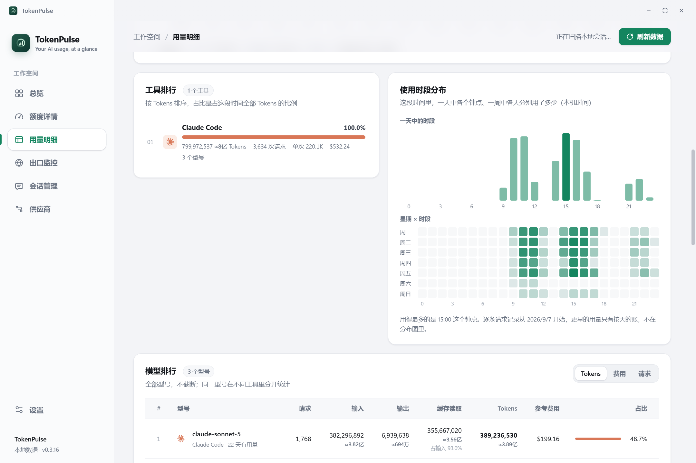<p align="center"><sub>使用时段分布与完整的型号排行</sub></p></td>
</tr>
<tr>
<td>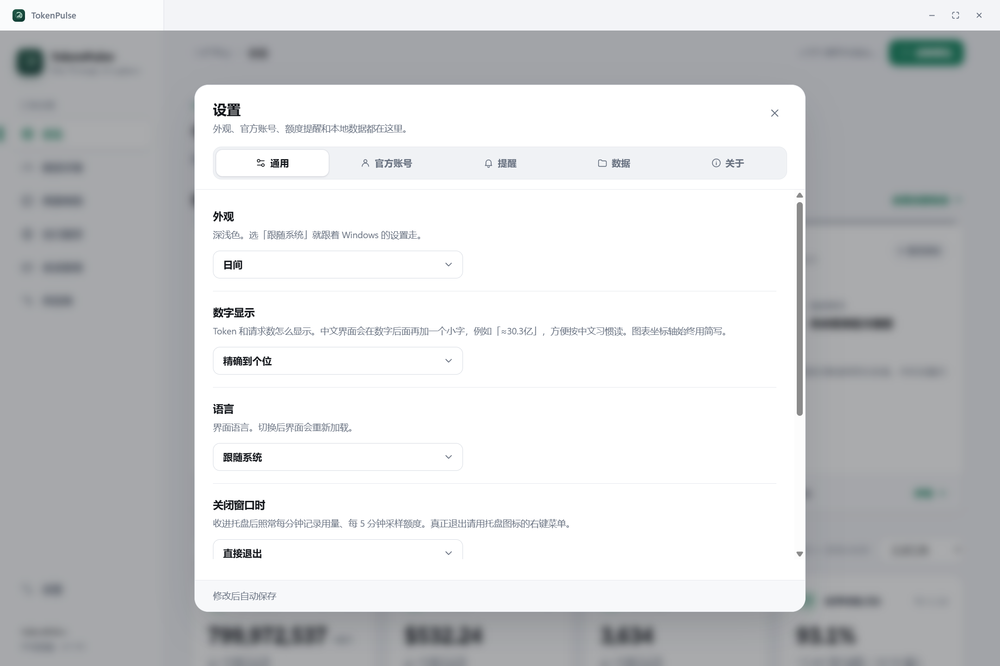<p align="center"><sub>设置：外观、官方账号、提醒、数据与自动更新</sub></p></td>
<td>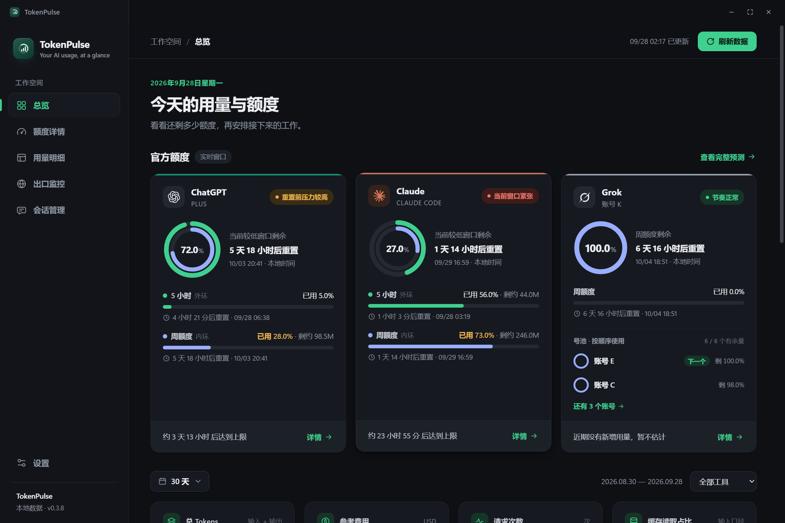<p align="center"><sub>深色主题</sub></p></td>
</tr>
</table>

## 📦 安装

到 [**Releases**](https://github.com/JohnMuyuan/TokenPulse/releases/latest) 下载最新版本：

| 文件 | 说明 |
|------|------|
| `TokenPulse-x.y.z-Setup.exe` | **安装版（推荐）**。可选安装路径，自动创建开始菜单快捷方式 |
| `TokenPulse-x.y.z-Portable.exe` | 免安装单文件，双击即用 |

启动后 TokenPulse 会常驻系统托盘。关闭窗口只会收回托盘，**退出请用托盘右键菜单**。

**自动更新**：安装版会在后台检查并下载新版本，等窗口收进托盘或最小化时静默安装、自动重启，不需要手动操作；可在「设置 → 关于」里改成「只提醒」或手动检查。便携版不支持自动更新，请到 Releases 下载新版本。

> [!TIP]
> 安装包没有代码签名，Windows SmartScreen 第一次运行时可能拦截，点「更多信息 → 仍要运行」即可。

**前提**：本机至少用过一个支持的 CLI。要看官方额度，还需要在对应 CLI 里登录过官方账号。哪家凭据过期或没登录，那家就不显示，不影响其他几家。

## 🧠 工作原理

<details open>
<summary><b>用量从哪来</b></summary>

<br>

每家 CLI 在每次 API 请求后都会往自己的会话文件里写一条 usage。这是本机唯一一份「全都算上」的账。TokenPulse 按字节偏移增量读取这些文件，几百兆的会话文件也不会每次重读。

| CLI | 会话文件 |
|-----|----------|
| Claude Code | `~/.claude/projects/<项目>/<会话>.jsonl` |
| Codex CLI | `~/.codex/sessions/<日期>/rollout-*.jsonl` |
| Grok Build | `~/.grok/sessions/**/updates.jsonl` |

去重、缓存 token 口径和「官方账号 / 中转站」归属判断都做了专门处理，细节见 [HANDOFF.md](HANDOFF.md) §4。

</details>

<details open>
<summary><b>预测怎么算</b></summary>

<br>

官方接口只给出**当前时刻**的已用百分比，既没有历史，也不说额度到底是多少 token。所以 TokenPulse 每 5 分钟采一次样，自己积累历史：

- **达到上限的时间以最近趋势为主**：在最近 24 小时（5 小时窗口取最近 1 小时）里，用多个采样跨度计算加权中位数，降低单次跳点的影响；近期跨度不足时才退回整窗平均。近期没有新增用量时不输出虚假的耗尽时间。
- **最近 24 小时的速度**只用来提示「最快可能什么时候用完」，不当作结论。
- **整窗容量折算**：比如这周用了 9800 万 token、官方显示已用 24%，折算下来整周大约 4 亿 token。已用不到 2% 时不给出这个数，已用越多越准，界面上会标出可信度。
- **Token 与费用预测**：用整窗容量把百分比换成 Token 和费用——剩余还能用多少、按当前趋势到重置时会用多少。额度详情里还有「额度容量趋势」折线，看每个历史窗口折算出的总额度有没有变化；用得太少（< 2%）或本机没有用量的窗口不计入，已用不到 5% 的标为偏差较大。
- **跨越重置**：到点重置或手动重置之前的样本不计入。如果已经过了重置时间、接口还没再查过，就按新窗口从 0 开始算，不会沿用上个窗口的数字。

总览卡片上的圆环显示**剩余最少的那个窗口**，避免周额度充足时掩盖了 5 小时窗口快要用完；卡片底部直接给出「重置时预计已用多少」或「约多久后用完」。

</details>

<details>
<summary><b>关于费用</b></summary>

<br>

**费用是估算，不是账单。** Grok 在会话文件里自报了花费，直接采用。Claude Code 和 Codex 的会话文件里只有 token，只能按公开单价估算（见 `src/core/model-pricing.ts`）。未识别定价的模型显示为「未定价」，不会被当作免费。

额度监控只统计**走官方登录账号**的会话。用 API Key 或中转站跑的请求不占订阅额度，会被排除，界面上会写明排除了多少个会话。

</details>

## 🔒 数据与隐私

所有数据都只保存在本机的 `~/.tokenpulse/`，**不会上传到任何地方**。唯一的网络请求是向各家官方接口查询额度。

| 文件 | 内容 | 删除后 |
|------|------|--------|
| `usage-rollups.json` | 每个会话文件的扫描进度和统计结果 | 从头重扫一遍，几秒钟，不丢数据 |
| `quota-history.json` | 官方额度采样历史（永久保留） | 速度和预测要重新积累，**官方不提供历史，删了就找不回来** |
| `cc-switch.json` | 从 CC Switch 库里读出来的副本（只读它的库，不改） | 下次扫描重新读 |
| `cli-logins.json` | 各 CLI 登录过哪些账号、从什么时候开始（只有账号 id 和邮箱，不含凭据），用来把请求对到账号上 | 以后的请求照常对；之前的按最早的账号推断 |
| `knowledge.json` | 从 GitHub 下载的新版模型知识库（单价、型号等价规则、思考等级规则） | 回到安装包内置的那份 |
| `requests/<年-月>.jsonl` | 每一次请求的元数据（时间、型号、token、响应 ID、工作目录，不含正文） | 会话文件还在的部分下次扫描补回；CLI 已经清掉的会话就找不回来了 |
| `official-accounts.json` | 登记过的官方账号、活动选择，以及在 TokenPulse 里添加的账号的凭据（含 refresh token） | 回到使用各 CLI 当前登录的账号；在 TokenPulse 里添加的账号需要重新添加 |
| `prefs.json` | 开机自启、关窗收进托盘、提醒阈值 | 恢复默认设置 |

明细只按「日期 + 工具 + 模型」聚合，不读取、展示或导出会话正文。官方 CLI 自己的登录只读取、不复制；在设置里额外添加的 OAuth 账号，凭据（access token 和续期用的 refresh token）保存在本机 `~/.tokenpulse/official-accounts.json`，仅用于额度查询、不会上传，并在过期前自动续期；这个文件应按密码文件保护。CLI 自己的登录不会被 TokenPulse 续期，免得把 CLI 登出。唯一的系统级副作用是开机启动项（`HKCU\...\Run\com.tokenpulse.app`），可以在设置里关闭。

## 🛠 开发

```bash
npm install
npm run icons         # 生成 packaging/icon.png 和 tray.png
npm run dist:portable # 只编译免安装版，供本机测试
npm start             # 编译并启动
npm test              # 额度、扫描、看板、官方账号、请求流水与型号核验、知识库 / CC Switch / 英文词典
npm run test:ui       # Electron 界面测试：预测、筛选、主题、导出、布局与失败恢复
npm run test:update   # 自动更新：本地假更新服务器上走完检查 → 下载 → 校验 → 静默安装触发
npm run dist          # 重新生成图标并打包安装版与免安装版到 dist/（不会自动发布）
```

打开「设置 → 官方账号」即可添加多个官方账号。点击「添加账号」后，TokenPulse 调用对应的官方 CLI，在你的**默认浏览器**里打开官方授权页（浏览器里已登录的账号可以直接确认）；登录写进一个隔离的临时目录，不会动 CLI 自己的登录。**所有账号的额度都会查询**，首页和额度详情里一个账号一张卡片；在设置里可以拖动调整顺序、给账号起名字、删除不要的账号（CLI 还登录着的账号只能隐藏，随时可以恢复）。

TypeScript 编译到 `build/`，安装包输出到 `dist/`。开发模式下**不会写入开机启动项**，只有打包版才会真正设置自启。

<details>
<summary><b>项目结构</b></summary>

```
src/core/            纯逻辑，不依赖 Electron，可以单独 require 测试
  usage-scan.ts      增量扫描会话文件 → 按天 / 按小时的账
  quota.ts           查询三家官方额度接口
  quota-history.ts   额度采样历史
  quota-monitor.ts   速度、预测、健康度（纯函数）
  model-pricing.ts   模型单价表
  report.ts          汇总成界面使用的快照
  request-log.ts     每一次请求的流水（按月追加、去重、查询）
  request-verify.ts  型号核验规则（纯函数）
  cc-switch.ts       只读导入 CC Switch 的用量（node:sqlite）
  knowledge.ts       模型知识库：单价、型号等价规则、思考等级规则（knowledge/models.json，每天在线更新）
  report-worker.ts   在后台线程执行扫描与汇总
src/main/            Electron 主进程：托盘、定时器、IPC、通知
renderer/            界面：原生 JS、无构建步骤，图表为手写内联 SVG
  data.js            日期筛选、聚合、对比与 CSV 编码（浏览器 / Node 共用）
  brand.js           官方品牌图标（Claude / OpenAI / Grok）的 SVG 路径
scripts/             测试、截图与图标生成
```

`scripts/capture-ui.cjs` 生成 README 的截图到 `artifacts/ui/`（`npx electron scripts/capture-ui.cjs`）：**不读本机的任何真实数据**——数据目录和用户主目录都指向新建的临时目录，界面切到软件自带的演示数据（虚构账号，和新手引导同一份），出口监控用文档专用地址段的示意数据，也不向官方查额度。每张图截完会检查页面上有没有邮箱、本机用户名或主目录路径，有就停下、不写文件。

</details>

<details>
<summary><b>打包卡在 winCodeSign？</b></summary>

<br>

Windows 上第一次打包可能报：

```
ERROR: Cannot create symbolic link : 客户端没有所需的特权
  ...\Cache\winCodeSign\<随机数>\darwin\10.12\lib\libcrypto.dylib
```

electron-builder 下载的 winCodeSign 压缩包里带了 macOS 符号链接，Windows 没开「开发者模式」时建不了，整个解压就会失败。项目不做签名，只需要其中的 `rcedit`。手动解压一次、跳过 macOS 部分即可：

```bash
CACHE="$LOCALAPPDATA/electron-builder/Cache/winCodeSign"
# 先跑一次 npm run dist，让它把 .7z 下载下来（解压会失败，没关系）
SRC=$(ls -S "$CACHE"/*.7z | head -1)
node_modules/7zip-bin/win/x64/7za.exe x -bd "$SRC" -o"$CACHE/winCodeSign-2.6.0" '-x!darwin*'
rm -f "$CACHE"/*.7z
```

目录名必须正好是 `winCodeSign-2.6.0`。版本号可以用下面的命令查：

```bash
node_modules/app-builder-bin/win/x64/app-builder.exe download-artifact --name winCodeSign
```

</details>

<div align="center">
<br>
<sub>Made with ☕ for people who live in the terminal.</sub>
</div>
